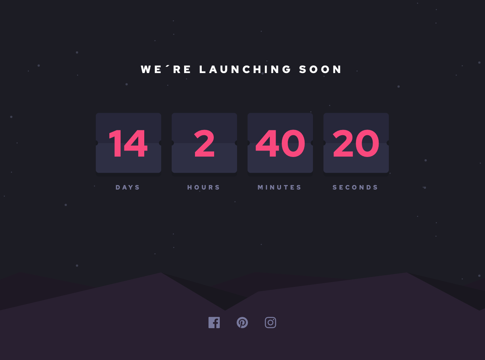

# Frontend Mentor - Launch countdown timer solution

This is a solution to the [Launch countdown timer challenge on Frontend Mentor](https://www.frontendmentor.io/challenges/launch-countdown-timer-N0XkGfyz-). Frontend Mentor challenges help you improve your coding skills by building realistic projects. 

## Table of contents

- [Overview](#overview)
  - [The challenge](#the-challenge)
  - [Screenshot](#screenshot)
  - [Links](#links)
- [My process](#my-process)
  - [Built with](#built-with)
  - [Useful resources](#useful-resources)
- [Author](#author)

## Overview

### The challenge

Users should be able to:

- See hover states for all interactive elements on the page
- See a live countdown timer that ticks down every second (start the count at 14 days)
- ~~**Bonus**: When a number changes, make the card flip from the middle~~

### Screenshot

### Links

- Solution URL: [APP Code](https://github.com/cristianpoleyJS/launch-countdown-timer)
- Live Site URL: [APP in Netlify](https://launch-countdown-timer-cristianpoleyjs.netlify.app/)

## My process

### Built with

- Semantic HTML5 markup
- CSS custom properties
- Flexbox
- CSS Grid
- [Svelte](https://svelte.dev/) - JS library

### Useful resources

- [How To Create a Countdown](https://www.w3schools.com/howto/howto_js_countdown.asp)

## Author

- Website - [Cristian Poley](https://www.cristianpoley.com)
- Frontend Mentor - [@cristianpoleyjs](https://www.frontendmentor.io/profile/cristianpoleyJS)
- Twitter - [@cristianpoley](https://www.twitter.com/cristianpoley)